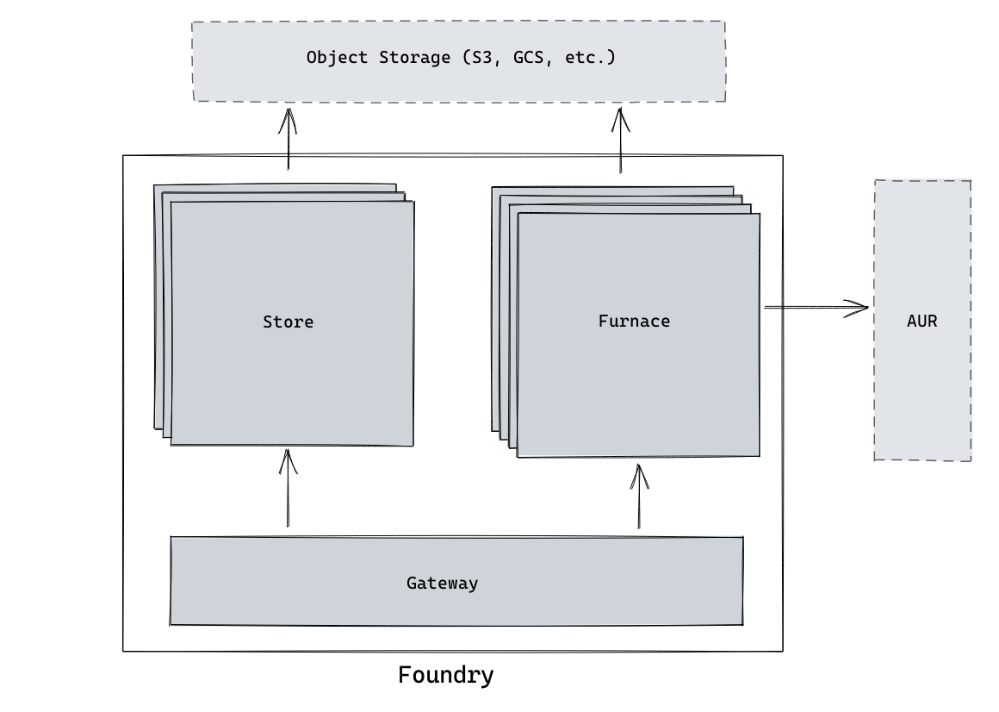

# `foundry`

## Overview

Foundry is a custom package repository for Arch Linux that builds the packages on the fly from [AUR](https://aur.archlinux.org).

The goals of the project are:
- Make it easy to run a custom package repository for Arch Linux.
- Leverage Object Storages to provide a cost efficient and scalable package storage.

## Architecture

Foundry is split into three components:
- **Furnace** is responsible for building the packages. Upon receiving the request it will fetch the package details from AUR. It leverages the [Arch Build System](https://wiki.archlinux.org/index.php/Arch_Build_System) to build the package archive and then uploads it to the object storage bucket. It's stateless so you can run as many furnaces as you want.
- **Store** is responsible to managing an inventory of all packages. It'll serve the package database and the packages built by Furnace.
- **Gateway** is the entry-point for all external requests to Foundry. It also coordinates between all other components, routing requests where they need to go.

The packages are stored in an Object Storage backend such as AWS S3 or GCS. Furnace uploads the packages to an object storage bucket after building, this gets picked up by the Stores and they update their package database accordingly.

## Contributing
Contributions are welcome!
